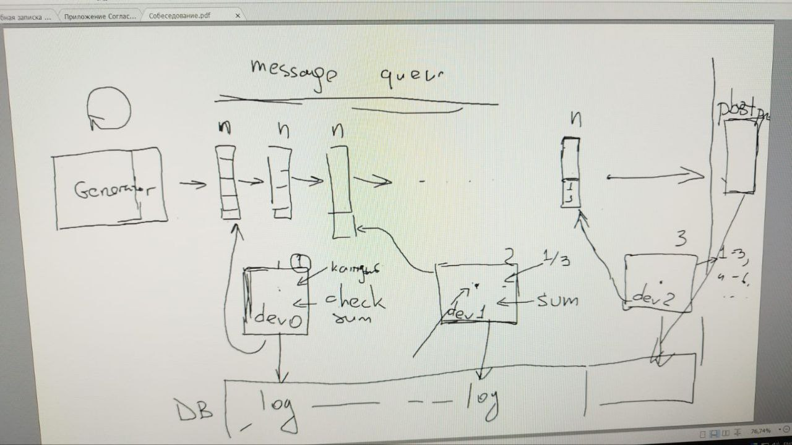

# kazmngz - это тестовое задание 

### как быстро запустить?

1.создайте папку
```console
mkdir test_mz && cd test_mz
```

2.скопируйте данный репозиторий
    
```console
git clone https://github.com/MukhamedZhumabek/kazmngz.git && cd kazmngz
```

3.скрипт для сборки проекта(запускается только 1 раз)
скрипт добавит необходимые репозитории, логи.

```console
bash start.sh
```

4.Поднять проект.

!Важно. При запуске проекта, сервис generator начнет генерировать по дефолту 50 запросов в секунду в течении 60 секунд

Параметры запуска можно изменить  docker-compose.yml -> generator -> command

python main.py {rpc} {duration}


```console
docker-compose up -d
```

данные для подключения к базе .env.postgres

логи пишутся в /logs

запустить тестовое еще раз(можно задать другой rpc и duration)
```console
docker-compose restart generator
```

### краткое описание 
>#### схема
>
>#### сервис generator
> генерирует 32 битное число
> {rpc} раз в секунду в течении {duration} секунд. По дефолту 50 rpc, 60 секунд.
> Данные в формате {'data': бинарная строка, 'control_sum': sha256 хэш строки}
> сообщения пишутся в первую очередь rabbitmq
>#### сервис dev0
> получает сообщения от сервиса generator
> проверяет контрольную сумму, если все верно сообщения пишутся во вторую очередь rabbitmq
>#### сервис dev1
> получает сообщения сервиса dev0
> группирует 3 сообщения в 1, создает новую контрольную сумму
> отправляет данные в третью очередь rabbitmq
>#### сервис dev2
> получает сообщения от dev1
> пишет данные в postgresql


